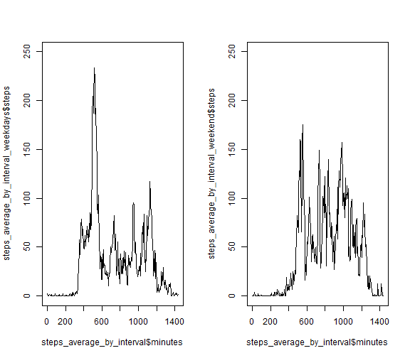

# PA1_template


## Reading the dataset

This is a report of analysis of the "activity.csv" dataset.


```r
data <- read.csv("activity.csv")
head(data)
```

```
##   steps       date interval
## 1    NA 2012-10-01        0
## 2    NA 2012-10-01        5
## 3    NA 2012-10-01       10
## 4    NA 2012-10-01       15
## 5    NA 2012-10-01       20
## 6    NA 2012-10-01       25
```

## Processing the dataset

This is to change the format of the date from character format to Date format.


```r
data$date <- as.Date(data$date,format="%Y-%m-%d")
head(data)
```

```
##   steps       date interval
## 1    NA 2012-10-01        0
## 2    NA 2012-10-01        5
## 3    NA 2012-10-01       10
## 4    NA 2012-10-01       15
## 5    NA 2012-10-01       20
## 6    NA 2012-10-01       25
```

## Plotting histogram of total number of steps per day

aggregate function is used to sun the number of steps in each given day.


```r
steps_in_a_day <- aggregate(steps~date,data,sum)
with(steps_in_a_day,hist(steps,breaks = 10))
```


## Mean and Median of steps in a day


```r
aggregate(steps~date,data,mean)
```

```
##          date      steps
## 1  2012-10-02  0.4375000
## 2  2012-10-03 39.4166667
## 3  2012-10-04 42.0694444
## 4  2012-10-05 46.1597222
## 5  2012-10-06 53.5416667
## 6  2012-10-07 38.2465278
## 7  2012-10-09 44.4826389
## 8  2012-10-10 34.3750000
## 9  2012-10-11 35.7777778
## 10 2012-10-12 60.3541667
## 11 2012-10-13 43.1458333
## 12 2012-10-14 52.4236111
## 13 2012-10-15 35.2048611
## 14 2012-10-16 52.3750000
## 15 2012-10-17 46.7083333
## 16 2012-10-18 34.9166667
## 17 2012-10-19 41.0729167
## 18 2012-10-20 36.0937500
## 19 2012-10-21 30.6284722
## 20 2012-10-22 46.7361111
## 21 2012-10-23 30.9652778
## 22 2012-10-24 29.0104167
## 23 2012-10-25  8.6527778
## 24 2012-10-26 23.5347222
## 25 2012-10-27 35.1354167
## 26 2012-10-28 39.7847222
## 27 2012-10-29 17.4236111
## 28 2012-10-30 34.0937500
## 29 2012-10-31 53.5208333
## 30 2012-11-02 36.8055556
## 31 2012-11-03 36.7048611
## 32 2012-11-05 36.2465278
## 33 2012-11-06 28.9375000
## 34 2012-11-07 44.7326389
## 35 2012-11-08 11.1770833
## 36 2012-11-11 43.7777778
## 37 2012-11-12 37.3784722
## 38 2012-11-13 25.4722222
## 39 2012-11-15  0.1423611
## 40 2012-11-16 18.8923611
## 41 2012-11-17 49.7881944
## 42 2012-11-18 52.4652778
## 43 2012-11-19 30.6979167
## 44 2012-11-20 15.5277778
## 45 2012-11-21 44.3993056
## 46 2012-11-22 70.9270833
## 47 2012-11-23 73.5902778
## 48 2012-11-24 50.2708333
## 49 2012-11-25 41.0902778
## 50 2012-11-26 38.7569444
## 51 2012-11-27 47.3819444
## 52 2012-11-28 35.3576389
## 53 2012-11-29 24.4687500
```

```r
aggregate(steps~date,data,median)
```

```
##          date steps
## 1  2012-10-02     0
## 2  2012-10-03     0
## 3  2012-10-04     0
## 4  2012-10-05     0
## 5  2012-10-06     0
## 6  2012-10-07     0
## 7  2012-10-09     0
## 8  2012-10-10     0
## 9  2012-10-11     0
## 10 2012-10-12     0
## 11 2012-10-13     0
## 12 2012-10-14     0
## 13 2012-10-15     0
## 14 2012-10-16     0
## 15 2012-10-17     0
## 16 2012-10-18     0
## 17 2012-10-19     0
## 18 2012-10-20     0
## 19 2012-10-21     0
## 20 2012-10-22     0
## 21 2012-10-23     0
## 22 2012-10-24     0
## 23 2012-10-25     0
## 24 2012-10-26     0
## 25 2012-10-27     0
## 26 2012-10-28     0
## 27 2012-10-29     0
## 28 2012-10-30     0
## 29 2012-10-31     0
## 30 2012-11-02     0
## 31 2012-11-03     0
## 32 2012-11-05     0
## 33 2012-11-06     0
## 34 2012-11-07     0
## 35 2012-11-08     0
## 36 2012-11-11     0
## 37 2012-11-12     0
## 38 2012-11-13     0
## 39 2012-11-15     0
## 40 2012-11-16     0
## 41 2012-11-17     0
## 42 2012-11-18     0
## 43 2012-11-19     0
## 44 2012-11-20     0
## 45 2012-11-21     0
## 46 2012-11-22     0
## 47 2012-11-23     0
## 48 2012-11-24     0
## 49 2012-11-25     0
## 50 2012-11-26     0
## 51 2012-11-27     0
## 52 2012-11-28     0
## 53 2012-11-29     0
```

Median of the steps on all days is 0 because for most of the 5 minutes interval, the person is at rest, i.e number of steps is 0.

## Mean by interval in the day

aggregate function is used again to calculate average number of steps in a given time interval. The interval is given the form of "2150" as in 21 hours and 50 minutes. Hence, I used integer operations to convert this into minutes as 21*60+50 = 1310 minutes. Total number of minutes in a day is 1440.


```r
steps_average_by_interval <- aggregate(steps~interval,data,mean)
steps_average_by_interval$minutes <- (steps_average_by_interval$interval%/%100)*60 +steps_average_by_interval$interval%%100
with(steps_average_by_interval,plot(minutes,steps,type="l"))
```


## Time interval with maximum average number of steps


```r
max_interval <- which(steps_average_by_interval$steps == max(steps_average_by_interval$steps))
steps_average_by_interval$interval[max_interval]
```

```
## [1] 835
```

## Total missing values in the dataset


```r
sum(is.na(data))
```

```
## [1] 2304
```

## Imputing values to create a new dataset

ifelse() function has been used. If the value is missig, the steps has been set as average number of steps in that particular time interval.


```r
test <- data
test$steps <- ifelse(is.na(test$steps),steps_average_by_interval$steps[steps_average_by_interval$interval==test$interval] , test$steps)
```

## Plots and analysis on the new dataset


```r
steps_in_a_day_imputed <- aggregate(steps~date,test,sum)
with(steps_in_a_day_imputed,hist(steps,breaks = 10))
```


```r
aggregate(steps~date,test,mean)
```

```
##          date      steps
## 1  2012-10-01 37.3825996
## 2  2012-10-02  0.4375000
## 3  2012-10-03 39.4166667
## 4  2012-10-04 42.0694444
## 5  2012-10-05 46.1597222
## 6  2012-10-06 53.5416667
## 7  2012-10-07 38.2465278
## 8  2012-10-09 44.4826389
## 9  2012-10-10 34.3750000
## 10 2012-10-11 35.7777778
## 11 2012-10-12 60.3541667
## 12 2012-10-13 43.1458333
## 13 2012-10-14 52.4236111
## 14 2012-10-15 35.2048611
## 15 2012-10-16 52.3750000
## 16 2012-10-17 46.7083333
## 17 2012-10-18 34.9166667
## 18 2012-10-19 41.0729167
## 19 2012-10-20 36.0937500
## 20 2012-10-21 30.6284722
## 21 2012-10-22 46.7361111
## 22 2012-10-23 30.9652778
## 23 2012-10-24 29.0104167
## 24 2012-10-25  8.6527778
## 25 2012-10-26 23.5347222
## 26 2012-10-27 35.1354167
## 27 2012-10-28 39.7847222
## 28 2012-10-29 17.4236111
## 29 2012-10-30 34.0937500
## 30 2012-10-31 53.5208333
## 31 2012-11-02 36.8055556
## 32 2012-11-03 36.7048611
## 33 2012-11-05 36.2465278
## 34 2012-11-06 28.9375000
## 35 2012-11-07 44.7326389
## 36 2012-11-08 11.1770833
## 37 2012-11-11 43.7777778
## 38 2012-11-12 37.3784722
## 39 2012-11-13 25.4722222
## 40 2012-11-15  0.1423611
## 41 2012-11-16 18.8923611
## 42 2012-11-17 49.7881944
## 43 2012-11-18 52.4652778
## 44 2012-11-19 30.6979167
## 45 2012-11-20 15.5277778
## 46 2012-11-21 44.3993056
## 47 2012-11-22 70.9270833
## 48 2012-11-23 73.5902778
## 49 2012-11-24 50.2708333
## 50 2012-11-25 41.0902778
## 51 2012-11-26 38.7569444
## 52 2012-11-27 47.3819444
## 53 2012-11-28 35.3576389
## 54 2012-11-29 24.4687500
```

```r
aggregate(steps~date,test,median)
```

```
##          date    steps
## 1  2012-10-01 34.11321
## 2  2012-10-02  0.00000
## 3  2012-10-03  0.00000
## 4  2012-10-04  0.00000
## 5  2012-10-05  0.00000
## 6  2012-10-06  0.00000
## 7  2012-10-07  0.00000
## 8  2012-10-09  0.00000
## 9  2012-10-10  0.00000
## 10 2012-10-11  0.00000
## 11 2012-10-12  0.00000
## 12 2012-10-13  0.00000
## 13 2012-10-14  0.00000
## 14 2012-10-15  0.00000
## 15 2012-10-16  0.00000
## 16 2012-10-17  0.00000
## 17 2012-10-18  0.00000
## 18 2012-10-19  0.00000
## 19 2012-10-20  0.00000
## 20 2012-10-21  0.00000
## 21 2012-10-22  0.00000
## 22 2012-10-23  0.00000
## 23 2012-10-24  0.00000
## 24 2012-10-25  0.00000
## 25 2012-10-26  0.00000
## 26 2012-10-27  0.00000
## 27 2012-10-28  0.00000
## 28 2012-10-29  0.00000
## 29 2012-10-30  0.00000
## 30 2012-10-31  0.00000
## 31 2012-11-02  0.00000
## 32 2012-11-03  0.00000
## 33 2012-11-05  0.00000
## 34 2012-11-06  0.00000
## 35 2012-11-07  0.00000
## 36 2012-11-08  0.00000
## 37 2012-11-11  0.00000
## 38 2012-11-12  0.00000
## 39 2012-11-13  0.00000
## 40 2012-11-15  0.00000
## 41 2012-11-16  0.00000
## 42 2012-11-17  0.00000
## 43 2012-11-18  0.00000
## 44 2012-11-19  0.00000
## 45 2012-11-20  0.00000
## 46 2012-11-21  0.00000
## 47 2012-11-22  0.00000
## 48 2012-11-23  0.00000
## 49 2012-11-24  0.00000
## 50 2012-11-25  0.00000
## 51 2012-11-26  0.00000
## 52 2012-11-27  0.00000
## 53 2012-11-28  0.00000
## 54 2012-11-29  0.00000
```

Mean of steps with days having NA values increased. Median of steps for a day remained at 0 except for 1st days which shows a non-zero value because most of the data on that day is imputed based on average.

## Creating a new column of factor varible weekday and weekend


```r
test$weekday <- weekdays(test$date)
test$weekday <- test$weekday == "Saturday" | test$weekday == "Sunday"
test$weekday <- factor(test$weekday,labels = c("weekday","weekend"))
```

## Plotting two time series plots of weekdays and weekend


```r
steps_average_by_interval_weekdays <- aggregate(steps~interval,subset(test,weekday=="weekday"),mean)
steps_average_by_interval_weekend <- aggregate(steps~interval,subset(test,weekday=="weekend"),mean)

par(mfrow=c(1,2))

plot(steps_average_by_interval$minutes,steps_average_by_interval_weekdays$steps,type="l",ylim = c(0,250))
plot(steps_average_by_interval$minutes,steps_average_by_interval_weekend$steps,type="l",ylim = c(0,250))
```


